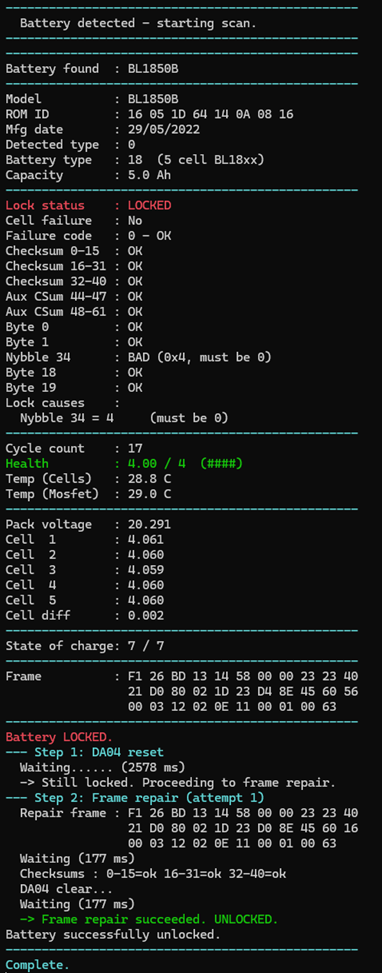
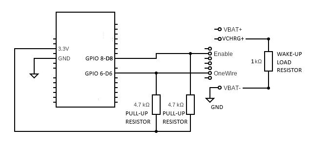

# 🔋 (Automatic) Makita Battery Monitor / Unlocker

> Plug in a battery. Get instant readouts on voltage, health, temperature, cycle count, lock state, and more.  
> Locked battery? — no phone or PC required. It unlocks itself automatically.

---

## What It Does

Insert any Makita 18 V or 36 V Li-Ion pack and within 2 seconds you get a full report:

- ✅ **Model & identity** — reads the battery's model string and unique ROM ID
- ⚡ **Voltage** — full pack voltage plus every individual cell, with imbalance flagging
- 🌡️ **Temperature** — live BMS thermistor reading in °C
- 🔋 **Health** — degradation score from 0–4 with a visual bar (`####`, `###-`, etc.)
- 🔄 **Cycle count** — how many full charge/discharge cycles the pack has seen
- 🔒 **Lock status** — LOCKED or UNLOCKED, with the specific failure code
- 💡 **Status LED** — onboard NeoPixel shows device state at a glance
- 🔦 **Battery LEDs** — 1 flash on detection, 2 before unlock or repair, 3 if unlocked and good checksums
- 🛠️ **Auto-unlock** — performs a charger-style unlock sequence automatically on locked packs
- 🔧 **Frame repair** — recalculates and rewrites corrupt checksums without touching any other battery data

No configuration. No button presses. Just insert the battery and it runs. Remove it and the device waits for the next one.

> Remember to have the PC/Phone plugged in and ready before plugging in a battery if you want to see the results of the first scan!

---

## Status Light (RP2040 Zero)

| Colour      | Meaning                                                        |
|-------------|----------------------------------------------------------------|
| Off         | No battery / idle                                              |
| 🟢 Green    | Battery detected — scan starting                               |
| 🔵 Blue     | Scan complete, battery healthy and unlocked                    |
| 🟡 Yellow   | Battery locked — error reset attempts in progress              |
| 🟣 Purple   | Checksums corrupt — writing corrected frame to BMS             |
| 🔴 Red      | Unlock failed, or BMS dead (failure code 15)                   |

---

## Battery LED Indicators

The battery's own LED indicators will flash during a scan — you can tell what's happening just by watching the pack itself, no serial monitor needed.

| Flashes | When                                        |
|---------|---------------------------------------------|
| 1×      | Battery detected — scan starting            |
| 2×      | About to attempt unlock or frame repair     |
| 3×      | Unlocked and good checksums                 |

---

The included apps connect automatically over USB — no serial monitor setup needed.

| Platform | File | Notes |
|----------|------|-------|
| Windows  | `Makita_Battery_Monitor.exe` | Auto-detects USB serial, colourised output |
| Android  | `makita_battery_monitor_android_apk.zip` | Connect via USB OTG cable |
| Any OS   | `makita_battery_monitor.py` | Python script, same features |

All three trigger a scan automatically on connect and colourise the output (lock state, health, errors).

---

## Supported Battery Types

| Type | Voltages | Temperature | Health | Counters | Charge Level | Unlock |
|------|----------|-------------|--------|----------|--------------|--------|
| 0    | ✅       | ✅          | ✅     | ✅       | ✅           | ✅     |
| 2    | ✅       | ✅          | ✅     | ✅       | ✅           | ✅     |
| 3    | ✅       | ✅          | ✅     | ✅       | ✅           | ✅     |
| 5 (F0513 based)   | ✅       | ✅          | ✅     | —        | —            | —      |
| 6  (10 cell)  | ✅       | ✅          | ✅     | —        | —            | —      |
| Unknown / Old | ✅ | —        | ✅     | —        | —            | —      |

Types 5 and 6 have their own dedicated voltage and temperature commands and are fully read-out, but have no documented test mode, unlock, or counter commands — so none are attempted. Sending undocumented commands to these types risks corrupting BMS state with no guaranteed recovery path.

---

## Example Readout

---

## Reading the Output

### 🔋 Health Rating

| Rating    | Bar    | What it means                   |
|-----------|--------|---------------------------------|
| 3.5 – 4.0 | `####` | Excellent                       |
| 2.5 – 3.5 | `###-` | Good                            |
| 1.5 – 2.5 | `##--` | Fair — consider retiring soon   |
| 0.5 – 1.5 | `#---` | Poor                            |
| 0.0 – 0.5 | `----` | Dead / not recoverable          |

### 🔒 Lock / Failure Codes

| Code | Meaning                          |
|------|----------------------------------|
| 0    | OK — no fault                    |
| 1    | Overloaded                       |
| 5    | Warning                          |
| 15   | Critical — BMS dead (no unlock attempted) |

### ⚡ Cell Imbalance

The `Cell diff` value is the spread between your highest and lowest cell voltage. Anything above **~0.050 V** is worth watching — it indicates the cells are drifting and may need balancing.

### 🔌 State of Charge (0–7 scale)

Available on most battery types. This is the BMS's own internal coarse estimate, not a precision fuel gauge — treat it as a rough indicator.

---

## Auto-Unlock

If a battery is locked (and not dead), the monitor performs a charger-style unlock sequence automatically. There are two stages:

### Stage 1 — Error reset (yellow)
The monitor power-cycles the bus, sends the standard `DA 04` error-reset command, then re-checks all three checksums. This handles the most common lock conditions where the BMS can self-correct in a single pass. If it works, done. If checksums are still bad, move to Stage 2. If the lock persists for a non-checksum reason, the LED turns red — retrying the same command won't help.

### Stage 2 — Frame write (purple)
If checksums remain corrupt after the reset, the BMS cannot self-repair them. The monitor reads the battery's own live data frame, recalculates the correct checksum values from the actual data already stored, and writes the corrected frame back to the BMS. Only the checksum bytes are changed — cycle count, capacity, health history, and all other data are left completely untouched. The result is read back and verified before declaring success. This stage is attempted once. If it fails, the LED turns red.

Failure code 15 (BMS dead) skips both stages entirely — those packs cannot be recovered this way.

---

## Manual Rescan

Hit `Enter` (or send `S`) over the serial monitor at any time to trigger a fresh scan of the currently inserted battery. Handy after a tool draw-down or thermal event to check updated state.

---
---

# Technical Reference

## Supported Boards

| Board                   | PlatformIO env              | Notes                                  |
|-------------------------|-----------------------------|----------------------------------------|
| Arduino Uno             | `uno`                       | Pull-ups to 5 V — see below            |
| Arduino Nano            | `nano`                      | Pull-ups to 5 V — see below            |
| ESP32-C3 SuperMini      | `esp32-c3-devkitm-1`        | Pull-ups to 3.3 V only — see below     |
| Waveshare RP2040 Zero   | `waveshare_rp2040_zero`     | Pull-ups to 3.3 V only — UF2 available |

---

## Hardware

**Two 4.7 kΩ pull-up resistors are required** — one from the 1-Wire data pin to supply voltage, and one from the bus enable pin to supply voltage. Using the default pin assignments this means **pin 6 → 4.7 kΩ → VCC** and **pin 8 → 4.7 kΩ → VCC**.

This is the standard 1-Wire pull-up value — lower values overdrive the bus and higher values cause slow rise times that break timing.

**Pull-up voltage depends on your board:**

- **Arduino Uno / Nano** — pull up to **5 V**. The ATmega328P runs at 5 V and its logic HIGH threshold (~3.0 V) leaves almost no margin when pulling up to 3.3 V, causing unreliable reads. The battery's BMS data pin can tolerate 5 V in practice.
- **ESP32-C3 / RP2040 Zero** — pull up to **3.3 V only**. These are 3.3 V-native devices and 5 V on a GPIO will damage them.

> **Optional** — A 1 kΩ load resistor may be required across the battery's main power terminals (B+ to B−), as some batteries enter a deep sleep state and will not respond on the 1-Wire bus until they detect current draw on the power terminals — toggling ENABLE alone is not sufficient to wake them. A 1 kΩ resistor draws enough current to reliably trigger BMS wake-up while remaining cool enough for a standard ¼ W or ½ W resistor. Values above ~1.5 kΩ have been found insufficient to wake some batteries. Plugging into a Makita charger will also wake a battery from this state.

> **Note** — A battery will accept charge from any DC power source in any state (deep sleep or error). Loading the battery with a 1 kΩ resistor then briefly grounding the enable pin should make any locked BMS wake up and output power without clearing errors, provided the battery is above ~8 V.

### Pin Assignments

| Signal       | Uno / Nano | ESP32-C3 SuperMini | RP2040 Zero |
|--------------|------------|--------------------|-------------|
| 1-Wire data  | 6          | 1                  | 6           |
| Bus enable   | 8          | 0                  | 8           |
| NeoPixel     | —          | —                  | 16          |

ESP32-C3 pin assignments can be overridden in `platformio.ini` via `ESP_EN_PIN` and `ESP_OW_PIN` build flags if your wiring differs from the SuperMini layout.

---

## Prerequisites

- [VS Code](https://code.visualstudio.com/)
- [PlatformIO extension](https://platformio.org/install/ide?install=vscode) for VS Code
- Git (optional — you can also download as ZIP)

---

## Build and Flash

### Option A — Pre-built UF2 (RP2040 Zero only, quickest)

1. Download the `.uf2` file.
2. Hold the BOOT button on the RP2040 Zero while plugging it in via USB — it mounts as a USB drive.
3. Drag and drop the `.uf2` file onto the drive. It will reboot and start automatically.
4. Open any serial terminal at **115200 baud** to see output.

### Option B — Build from source (all boards)

1. Clone or download this repository and open the folder in VS Code.
2. PlatformIO will auto-detect the project via `platformio.ini`.
3. In the PlatformIO sidebar select the environment for your board (e.g. `waveshare_rp2040_zero`).
4. Click **Build**, then **Upload** with your board connected via USB.
5. Open the serial monitor at **115200 baud** to see output.
